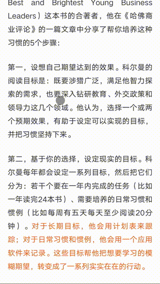

easy-marker
---
`easy-marker` is a library for marking text in html. An example is as follows:



## Install 
```bash
npm i easy-marker
```

## Usage

```js
import EasyMarker from 'easy-marker'

const easyMarker = new EasyMarker
const container = document.querySelector('xxxx')
easyMarker.create(container)
```
## API

* [EasyMarker](#EasyMarker)
    * [new EasyMarker(options)](#new_EasyMarker_new)
    * _instance_
        * [.create(containerElement, [scrollContainerElement], [excludeElements])](#EasyMarker+create)
        * [.getSelectText()](#EasyMarker+getSelectText) ⇒ <code>string</code>
        * [.highlightLine(selection, [id], [meta])](#EasyMarker+highlightLine)
        * [.highlightLines(lines)](#EasyMarker+highlightLines)
        * [.cancelHighlightLine(id)](#EasyMarker+cancelHighlightLine) ⇒ <code>boolean</code>
        * [.onHighlightLineClick(cb)](#EasyMarker+onHighlightLineClick)
        * [.destroy()](#EasyMarker+destroy)
    * _static_
        * [.create(containerElement, [scrollContainerElement], [excludeElements])](#EasyMarker.create) ⇒ [<code>EasyMarker</code>](#EasyMarker)
    * _inner_
        * [~menuClickHandler](#EasyMarker..menuClickHandler) : <code>function</code>
        * [~highlightLineClickHandler](#EasyMarker..highlightLineClickHandler) : <code>function</code>

<a name="new_EasyMarker_new"></a>

### new EasyMarker(options)
Creates an instance of EasyMarker.


| Param | Type | Description |
| --- | --- | --- |
| options | <code>Object</code> | options |
| options.menuItems | <code>Array.&lt;Object&gt;</code> | menu item option |
| options.menuItems[].text | <code>string</code> | menu text |
| options.menuItems[].handler | [<code>menuClickHandler</code>](#EasyMarker..menuClickHandler) | menu item click handler |
| options.menuTopOffset | <code>number</code> \| <code>string</code> | the offset from the top of the menu relative screen, default 0. |

**Example**  
```js
const em = new EasyMarker({
  menuTopOffset:'2rem',
  menuItems: [
    {
      text: '划线笔记',
      handler: function (data) {
        console.log('划线笔记', data, this)
        this.highlightLine(data,1)
      }
    },
    {
      text: '分享',
      handler: (data) => {console.log('分享',data)}
    },
    {
      text: '复制',
      handler: (data) => {console.log('分享',data)}
    }
  ]
 )

 em.create(document.querySelector('.article-body'),
   document.body,
   document.querySelectorAll('.article-body>:not(.text)')
```
<a name="EasyMarker+create"></a>

### easyMarker.create(containerElement, [scrollContainerElement], [excludeElements])
Initialization

**Kind**: instance method of [<code>EasyMarker</code>](#EasyMarker)  

| Param | Type | Description |
| --- | --- | --- |
| containerElement | <code>HTMLElement</code> | container element |
| [scrollContainerElement] | <code>HTMLElement</code> | scroll container element |
| [excludeElements] | <code>Array.&lt;HTMLElement&gt;</code> | not included elements |

<a name="EasyMarker+getSelectText"></a>

### easyMarker.getSelectText() ⇒ <code>string</code>
Get the selected text

**Kind**: instance method of [<code>EasyMarker</code>](#EasyMarker)  
<a name="EasyMarker+highlightLine"></a>

### easyMarker.highlightLine(selection, [id], [meta])
Highlight the lines between the specified nodes

**Kind**: instance method of [<code>EasyMarker</code>](#EasyMarker)  

| Param | Type | Description |
| --- | --- | --- |
| selection | <code>Object</code> | selection |
| selection.anchorNode | <code>Node</code> | start node |
| selection.anchorOffset | <code>number</code> | start node's text offset |
| selection.focusNode | <code>Node</code> | end node |
| selection.focusOffset | <code>number</code> | start node's text offset |
| [id] | <code>\*</code> | line id |
| [meta] | <code>\*</code> | meta information |

**Example**  
```js
const id = 2;
const selection = {
  anchorNode: textNodeA,
  anchorOffset: 1,
  focusNode: textNodeB,
  focusOffset: 2
};
const meta = { someKey: 'someValue' };
em.highlightLine(selection, id, meta);
```
<a name="EasyMarker+highlightLines"></a>

### easyMarker.highlightLines(lines)
Highlight multiple lines

**Kind**: instance method of [<code>EasyMarker</code>](#EasyMarker)  

| Param | Type |
| --- | --- |
| lines | <code>Array.&lt;Object&gt;</code> | 
| [lines[].id] | <code>\*</code> | 
| [lines[].meta] | <code>\*</code> | 
| lines[].selection | <code>Object</code> | 
| lines[].selection.anchorNode | <code>Node</code> | 
| lines[].selection.anchorOffset | <code>number</code> | 
| lines[].selection.focusNode | <code>Node</code> | 
| lines[].selection.focusOffset | <code>number</code> | 

**Example**  
```js
const id = 2;
const selection = {
  anchorNode: textNodeA,
  anchorOffset: 1,
  focusNode: textNodeB,
  focusOffset: 2
};
const meta = { someKey: 'someValue' };
em.highlightLines([{selection, id, meta}]);
```
<a name="EasyMarker+cancelHighlightLine"></a>

### easyMarker.cancelHighlightLine(id) ⇒ <code>boolean</code>
Cancel highlight

**Kind**: instance method of [<code>EasyMarker</code>](#EasyMarker)  

| Param | Type | Description |
| --- | --- | --- |
| id | <code>\*</code> | line ID |

<a name="EasyMarker+onHighlightLineClick"></a>

### easyMarker.onHighlightLineClick(cb)
Highlight line click handler

**Kind**: instance method of [<code>EasyMarker</code>](#EasyMarker)  

| Param | Type |
| --- | --- |
| cb | [<code>highlightLineClickHandler</code>](#EasyMarker..highlightLineClickHandler) | 

<a name="EasyMarker+destroy"></a>

### easyMarker.destroy()
Destroy instance

**Kind**: instance method of [<code>EasyMarker</code>](#EasyMarker)  
<a name="EasyMarker.create"></a>

### EasyMarker.create(containerElement, [scrollContainerElement], [excludeElements]) ⇒ [<code>EasyMarker</code>](#EasyMarker)
Initialization factory

**Kind**: static method of [<code>EasyMarker</code>](#EasyMarker)  

| Param | Type | Description |
| --- | --- | --- |
| containerElement | <code>HTMLElement</code> | container element |
| [scrollContainerElement] | <code>HTMLElement</code> | scroll container element |
| [excludeElements] | <code>Array.&lt;HTMLElement&gt;</code> | not included elements |

<a name="EasyMarker..menuClickHandler"></a>

### EasyMarker~menuClickHandler : <code>function</code>
Menu item click handler

**Kind**: inner typedef of [<code>EasyMarker</code>](#EasyMarker)  

| Param | Type | Description |
| --- | --- | --- |
| selection | <code>Object</code> | selection |
| selection.anchorNode | <code>Node</code> | start node |
| selection.anchorOffset | <code>number</code> | start node's text offset |
| selection.focusNode | <code>Node</code> | end node |
| selection.focusOffset | <code>number</code> | start node's text offset |

<a name="EasyMarker..highlightLineClickHandler"></a>

### EasyMarker~highlightLineClickHandler : <code>function</code>
Menu item click handler

**Kind**: inner typedef of [<code>EasyMarker</code>](#EasyMarker)  

| Param | Type | Description |
| --- | --- | --- |
| id | <code>\*</code> | line ID |
| meta | <code>\*</code> | meta information |
| selection | <code>Object</code> | selection |
| selection.anchorNode | <code>Node</code> | start node |
| selection.anchorOffset | <code>number</code> | start node's text offset |
| selection.focusNode | <code>Node</code> | end node |
| selection.focusOffset | <code>number</code> | start node's text offset |

